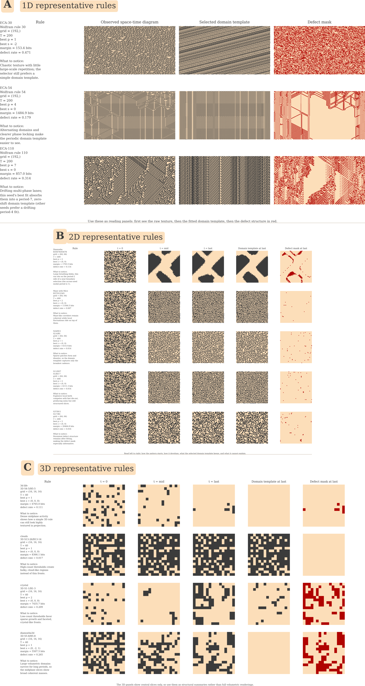

# ALIFE figure snippets

## Figure 1

File: `figures/alife_representative_rules.png`

Label: `fig:alife-representative-rules`

Caption:

Representative rules across 1D, 2D, and 3D. (A) Elementary cellular automata show the raw space-time diagram, the selected relative-periodic domain template, and the defect mask. (B) Representative 2D rules show early, middle, and late slices together with the selected domain template and the final defect mask. (C) Representative 3D rules show midplane slices through the observed space-time block, selected domain template, and defect mask. Across dimensions, the same selector extracts a global domain template and isolates the structured defects that remain.

LaTeX:

```tex
\begin{figure}[t]
  \centering
  \includegraphics[width=\linewidth]{figures/alife_representative_rules.png}
  \caption{Representative rules across 1D, 2D, and 3D. (A) Elementary cellular automata show the raw space-time diagram, the selected relative-periodic domain template, and the defect mask. (B) Representative 2D rules show early, middle, and late slices together with the selected domain template and the final defect mask. (C) Representative 3D rules show midplane slices through the observed space-time block, selected domain template, and defect mask. Across dimensions, the same selector extracts a global domain template and isolates the structured defects that remain.}
  \label{fig:alife-representative-rules}
\end{figure}
```

Markdown:



*Figure label suggestion: `fig:alife-representative-rules`*

## Figure 2

File: `figures/alife_rule_mechanisms.png`

Label: `fig:alife-rule-mechanisms`

Caption:

Local update mechanisms for the representative rule panel. (A) The studied 1D elementary rules are lookup tables on three-cell neighborhoods. (B) The studied 2D rules are totalistic Moore-neighborhood rules on eight neighbors, specified by birth and survival counts. (C) The studied 3D rules are totalistic 26-neighbor rules, again determined only by birth and survival counts. These mechanism diagrams clarify the local rule families whose global spatiotemporal organization is analyzed by the NML selector.

LaTeX:

```tex
\begin{figure}[t]
  \centering
  \includegraphics[width=\linewidth]{figures/alife_rule_mechanisms.png}
  \caption{Local update mechanisms for the representative rule panel. (A) The studied 1D elementary rules are lookup tables on three-cell neighborhoods. (B) The studied 2D rules are totalistic Moore-neighborhood rules on eight neighbors, specified by birth and survival counts. (C) The studied 3D rules are totalistic 26-neighbor rules, again determined only by birth and survival counts. These mechanism diagrams clarify the local rule families whose global spatiotemporal organization is analyzed by the NML selector.}
  \label{fig:alife-rule-mechanisms}
\end{figure}
```

Markdown:


*Figure label suggestion: `fig:alife-rule-mechanisms`*

